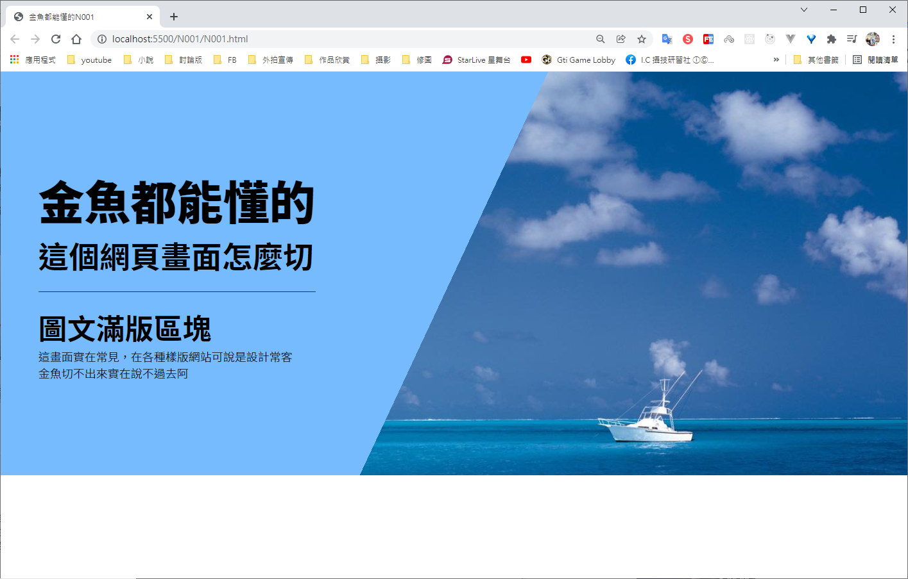
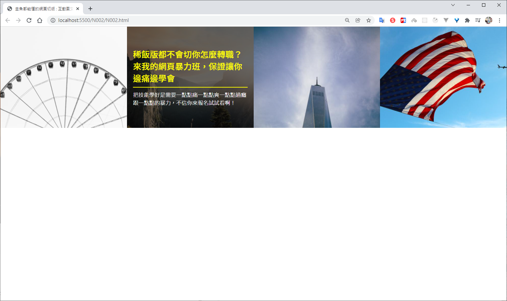
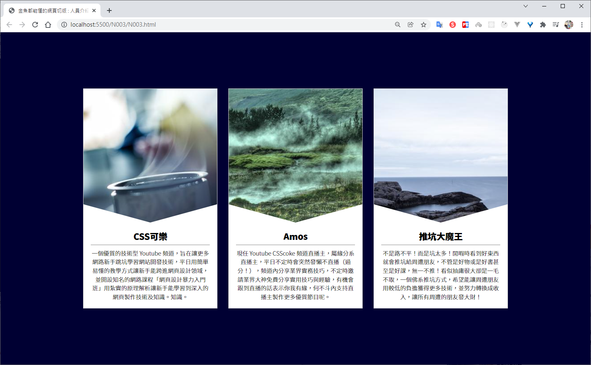
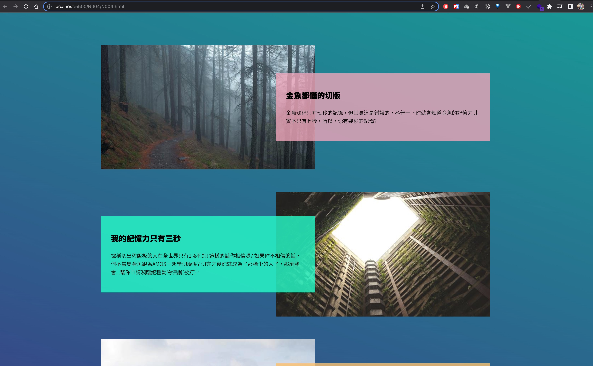
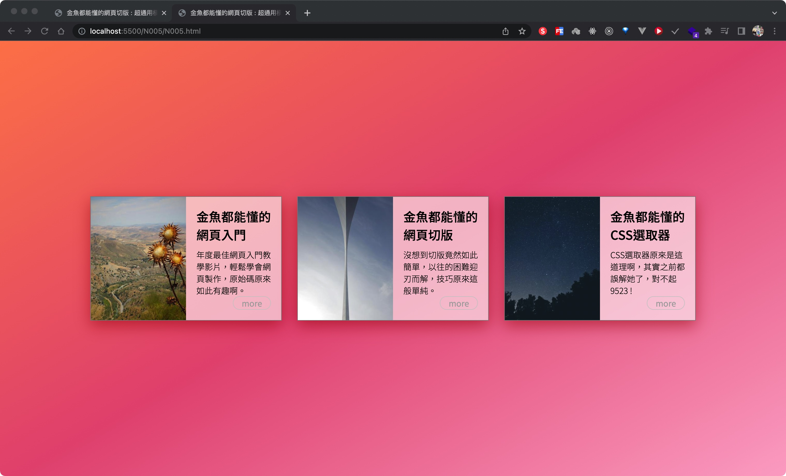

# 金魚都能懂的網頁切版

切版練習實作，也方便之後參考

# 線上DEMO

https://ivesshe.github.io/HTML_CSS_GoldFishLayout/

# 圖文滿版區塊 NO001

[圖文滿版區塊 NO001](./N001/N001.html)

# 互動圖文卡片 NO002

[互動圖文卡片 NO002](./N002/N002.html)

# 人員介紹卡片 NO003

[互動圖文卡片 NO003](./N003/N003.html)

# 金魚都能懂的網頁切版 : 交錯漂浮版 NO004

[金魚都能懂的網頁切版 : 交錯漂浮版 NO004](./N004/N004.html)

# 金魚都能懂的網頁切版 : 超通用橫式版面 NO005

[金魚都能懂的網頁切版 : 超通用橫式版面 NO005](./N005/N005.html)

# 金魚都能懂的網頁切版 : 網頁頁尾版塊 NO006

[金魚都能懂的網頁切版 : 網頁頁尾版塊 NO006](./N006/N006.html)

## 資料來源

CSScoke

https://www.youtube.com/watch?v=rwTMBmnIHcY&list=PLqivELodHt3hxeuLX8PYaI8u1GcDaBoJo&ab_channel=CSScoke